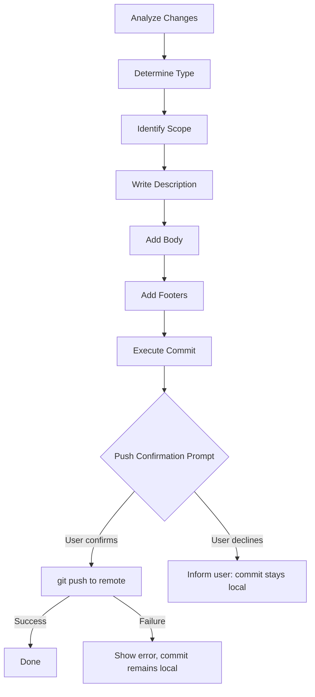

# Design Document: Git Committer Push Confirmation

## Overview

This feature adds a mandatory push confirmation step to the git-committer power's workflow. After every successful commit, the agent will prompt the user to confirm whether they want to push to the remote. This is implemented by updating two existing files: the steering file (`conventional-commits.md`) and the power documentation (`POWER.md`). No new code modules or services are introduced — this is a workflow and documentation refactor.

## Architecture

The git-committer power is a steering-based agent power. It has no runtime code; its behavior is defined entirely by:

1. `powers/git-committer/POWER.md` — User-facing documentation and feature description.
2. `powers/git-committer/steering/conventional-commits.md` — Agent steering instructions that define the commit workflow.

The push confirmation step is added as a new final step in the steering workflow. The agent, when following the steering instructions, will always ask the user before pushing.

## Components and Interfaces

### Steering File Changes (`conventional-commits.md`)

A new step 7 "Push Confirmation" is added to the "Workflow for Creating Commits" section:

- After step 6 (Add Footers) and the commit execution, the agent must ask the user if they want to push.
- If the user confirms, run `git push`.
- If the user declines, inform them the commit is local only.
- If the push fails, display the error and note the commit was created successfully but the push failed.

### POWER.md Changes

- Add a "Push Confirmation" section describing the behavior.
- Update the "Features" list to include push confirmation.
- Update usage examples to reflect the new flow.

## Data Models

No data models are needed. This feature modifies steering text and documentation only. The inputs and outputs are:

- **Input**: User's yes/no response to the push confirmation prompt.
- **Output**: Either a successful push, a skipped push message, or a push error message.

## Correctness Properties

*A property is a characteristic or behavior that should hold true across all valid executions of a system — essentially, a formal statement about what the system should do. Properties serve as the bridge between human-readable specifications and machine-verifiable correctness guarantees.*

This feature modifies only steering markdown files and documentation. There is no runtime code, no functions, and no data transformations. All acceptance criteria describe agent behavior driven by LLM interpretation of steering text, which cannot be verified through automated property-based testing.

No testable properties.

## Error Handling

The steering file instructs the agent to handle the single error scenario:

- **Push failure**: If `git push` fails after user confirmation, the agent must display the error output and clearly state that the commit was created successfully but the push did not succeed. This prevents the user from thinking their commit was lost.

No other error paths exist since the confirmation prompt is a simple yes/no interaction.

## Testing Strategy

Since this feature consists entirely of steering text and documentation changes (no executable code), traditional unit tests and property-based tests do not apply.

**Manual verification** is the appropriate testing approach:

1. Verify the steering file contains the push confirmation step as step 7 in the workflow.
2. Verify the POWER.md file documents the push confirmation behavior.
3. Manually test the agent by asking it to commit changes and confirming it asks about pushing.
4. Manually test the decline path — confirm the agent skips the push.
5. Manually test the error path — confirm the agent handles a push failure gracefully (e.g., no remote configured).

No automated test tasks will be generated for this feature.
